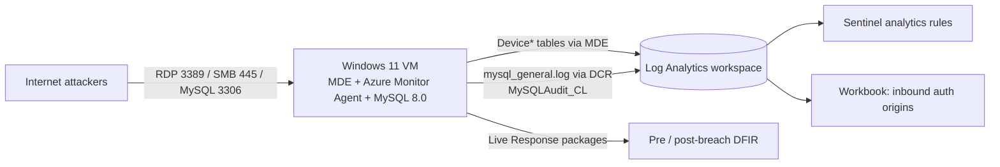

# Honeypot Lifecycle: Detect, Investigate, and Report on a Live Breach

An end-to-end blue-team lab. I built a Windows 11 + MySQL honeypot in Azure, wrote detections before exposing it, deliberately weakened it, let real internet attackers find it, then investigated, contained, and reported on what happened using Microsoft Defender for Endpoint (MDE), Microsoft Sentinel, and KQL.

**Tools:** Azure VM · Microsoft Defender for Endpoint (Live Response) · Microsoft Sentinel · Log Analytics · KQL · Azure Monitor Agent · MySQL 8.0 · MITRE ATT&CK

> This environment was intentionally vulnerable and ran in an isolated cyber-range subscription with restricted egress. Do not replicate the "weaken and expose" steps anywhere you don't fully control.

---

## What happened

The honeypot was exposed on **Aug 14, 2026**. Within hours, automated attackers found it.

| Layer | Outcome | Evidence |
|---|---|---|
| **MySQL (3306)** | **Compromised.** An attacker logged in as `root` after two failed attempts, dropped all observed tables and databases (`lnp_corp`, `sakila`, `world`), left a ransom note, and revoked root's own write privileges. Four more related IPs returned over the next three days to re-drop and re-create the note. Consistent with an automated "recover_your_data" ransom bot, not a targeted intrusion. | [`reports/Incident-Response-Report.pdf`](reports/Incident-Response-Report.pdf) |
| **RDP / SMB (3389, 445)** | **Attacked, not breached.** 463 failed NTLM network logons against common admin usernames (460 from a single Poland-based IP), plus one anonymous null-session logon that did nothing further. | [`reports/DFIR_Comparative_Report.md`](reports/DFIR_Comparative_Report.md) |
| **Host (OS level)** | Pre- vs post-breach MDE packages show no new accounts, services, scheduled tasks, autoruns, or listeners, and no real malware detections. The noisy delta was MDE's own collection activity. | [`reports/DFIR_Comparative_Report.md`](reports/DFIR_Comparative_Report.md) |

**Takeaway:** the database layer fell to a weak root credential exposed to the internet, while host forensics on the same VM found no evidence of OS-level compromise. Two independent data sources (MySQL audit logs and MDE host forensics) were needed to see the whole picture.

### Attack timeline (MySQL)

Times are America/Denver, as recorded in the source logs.

| Time | Event |
|---|---|
| Aug 14, 18:16 | First failed remote `root` login from `64.89.163.89` |
| Aug 14, 18:19 | Successful `root` login from the same IP (initial access) |
| Aug 14, 18:19–18:20 | Tables dropped, ransom-note table inserted, then `lnp_corp`, `sakila`, `world` dropped |
| Aug 14, 18:20 | Attacker revokes `INSERT/UPDATE/DELETE/DROP/CREATE` from `root@'%'` |
| Aug 16–17 | Return visits from `194.32.120.109` and three more `64.89.163.0/24` addresses; ransom demand changes between visits |
| Aug 16, 23:08 | 100 failed `root` logins from one scanner in about two minutes, no success |
| Aug 18 | Continued generic scanning (`admin`, `sa`, `root`), no destructive activity |

---

## How the lab is built

The full walkthrough is in [`Honeypot_Checklist.pdf`](Honeypot_Checklist.pdf). In short:

| Phase | What I did |
|---|---|
| 1. Build | Deployed a Windows 11 VM with a public IP, named to look like a real corporate host, onboarded to MDE |
| 2. MySQL | Installed MySQL 8.0, loaded a sample database (`lnp_corp`), enabled the general query log |
| 3. Logging | Shipped MDE device telemetry and the MySQL log (custom DCR into `MySQLAudit_CL`) to Log Analytics |
| 4. Detect | Wrote Sentinel analytics rules for successful VM logons and successful MySQL logins while the box was still clean |
| 5. Expose | Weakened accounts, MySQL root, firewall, and NSG on purpose; captured a baseline MDE investigation package |
| 6–7. Watch and analyze | Monitored `DeviceLogonEvents` and `MySQLAudit_CL`, then analyzed the authentication and query logs |
| 8. Contain | Isolated the VM in Defender and captured a post-breach investigation package |
| 9–10. Recover and report | Documented eradication and recovery steps and wrote the incident and DFIR reports |

---

## Repository contents

| Path | Description |
|---|---|
| [`Honeypot_Checklist.pdf`](Honeypot_Checklist.pdf) | Step-by-step lab methodology (phases 0–10) |
| [`reports/Incident-Response-Report.pdf`](reports/Incident-Response-Report.pdf) | Incident response report for the MySQL breach: timeline, IOCs, impact, root cause, recommendations |
| [`reports/DFIR_Comparative_Report.md`](reports/DFIR_Comparative_Report.md) | Host-level comparison of the pre- and post-breach MDE packages, with ATT&CK mapping, IOC list, and limitations |
| [`evidence/`](evidence/) | Pre- and post-breach MDE Live Response investigation packages (`.zip`) |
| [`queries/mysql-auth-logs.csv`](queries/mysql-auth-logs.csv) | MySQL authentication events (231 rows, Aug 14–18), parsed from `MySQLAudit_CL` |
| [`queries/mysql-queries.csv`](queries/mysql-queries.csv) | MySQL query log (927 rows, Aug 14–18), including the destructive statements |
| [`queries/sql-logon-attempts.csv`](queries/sql-logon-attempts.csv), [`queries/sql-queries.csv`](queries/sql-queries.csv) | Earlier exports of the same two tables (through Aug 17) |
| [`queries/attack-telemetry.csv`](queries/attack-telemetry.csv) | Source-IP summary from `DeviceLogonEvents` with attempt counts, success counts, and geolocation |
| [`workbooks/InboundAuth.json`](workbooks/InboundAuth.json) | Sentinel workbook: map and table of inbound logon origins |

---

## Using the workbook

The workbook plots the source of remote logons (`DeviceLogonEvents`, public IPs, `Network` and `RemoteInteractive` logon types) on a map, sized by attempts and colored by successful logons, with a companion table ranking each source IP and the accounts it touched. It covers VM logons only, not MySQL.

1. In **Microsoft Sentinel**, open **Workbooks** > **Add workbook** > **Edit** > **Advanced Editor** (`</>`).
2. Paste the contents of [`workbooks/InboundAuth.json`](workbooks/InboundAuth.json) and select **Apply**.
3. The file contains the workspace resource IDs from my lab. In each query tile, choose **your** Log Analytics workspace under the data source settings, otherwise the tiles will not resolve.
4. Save the workbook. The time range parameter defaults to 24 hours.

Requires a VM onboarded to MDE with the Defender XDR connector (or an equivalent path) populating `DeviceLogonEvents` in the workspace.

---

## Lessons learned

The recommendations from the incident report, in priority order:

1. **Remove direct internet exposure** of MySQL; allow only VPN, bastion, or known application IPs. (Critical)
2. **Eliminate remote root login**; use least-privilege named service accounts and rotate every credential on the instance. (Critical)
3. **Keep tested, offsite or immutable backups** with a defined RTO/RPO. Recovery could not be confirmed from the available data. (High)
4. **Forward database audit logs to the SIEM in near real time** and alert on `DROP DATABASE`, `DROP TABLE`, and mass privilege changes. This incident had to be reconstructed after the fact. (High)
5. **Add brute-force protection** such as connection throttling or a database firewall; one IP made 100 failed attempts in under two minutes with no lockout. (Medium)
6. **Get host-level telemetry** for every database server so process, file, and network events are available alongside audit logs. (Medium)

The DFIR report adds an NSG and firewall review for RDP (3389) and SMB (445), which were bound to all interfaces throughout.

---

## Limitations

- Exfiltration could not be confirmed or ruled out. No network transfer telemetry was available for the MySQL incident window.
- The incident report was built from the MySQL audit logs only. `DeviceProcessEvents`, `DeviceFileEvents`, `DeviceNetworkEvents`, and `NTANetAnalytics` were not part of that review.
- The MDE packages contain only the Security event log, with no System, Application, Sysmon, or PowerShell logs, and no memory or disk image, so in-memory implants and credential theft could not be assessed.
- The "pre-breach" package is a baseline, not a day-zero image; the host was already under an active MDE collection cycle.
- The two reports use different data sources and time windows, so attempt counts are not directly comparable.
- Geolocation comes from MaxMind GeoLite2 via `geo_info_from_ip_address()` and is approximate.

---

## Credits and notes

- Lab methodology follows the *Cyber Range Capstone: Live-Exposed Honeypot Lab* checklist included in this repo.
- Log analysis and first-draft reports were produced with LLM assistance, as the lab methodology prescribes.
- All IPs, ransom-note artifacts, and IOCs in this repo come from real attacker traffic against a disposable lab host. URLs are defanged in the reports.
